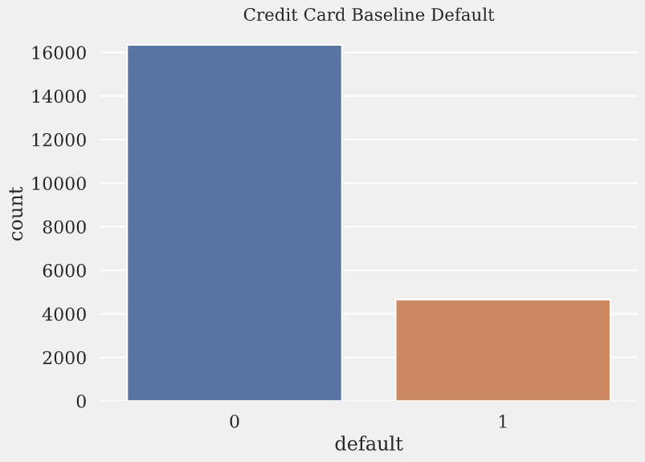

# Building a Model for Credit Card Default Prediction

**Project Author**:  Steven Yan

**Project Advisors**: Fangfang Lee, Joshua Szymanowski


# Background and Business Problem:

A credit card issuer based in the United States has forayed into the Asian market and wants to gain a better understanding of the customer base and its credit card habits. Building a supervised machine learning model for predicting the likelihood of default, as well as identifying the key factors that determine that likelihood would inform the issuer’s decision-making process on whom to give a credit card to and what credit limit to provide.

Many statistical methods in the past have been used to develop models of risk prediction and with the evolution of AI and machine learning to forecast credit risk.  From the perspective of risk control, predicting the probability of defaulting is more meaningful, pertinent, and tangible for practitioners.

Default occurs when a credit card customer fails to pay a calculated minimum monthly amount, comprising of interest and some principal amount. High default has been a major problem in the credit card market and has been growing in recent years despite the strength of the U.S. economy. Clearly credit card default is a complex phenomenon involving many factors beyond the scope of the present research. The variables which we have examined here capture some key behaviors and provide the issuer a better understanding of current and potential customers, specificially which would inform their strategy in the new market.

The goal behind using this model is to achieve two things:  to bring more consistency to the loaning process and investigate what key factors are behind a potential defaulter.


# Data Sources:

The dataset considered in this analysis is the *“Default of Credit Card Clients”* dataset released under the public license of *Creative Commons* and available on the [Kaggle website](https://www.kaggle.com/uciml/default-of-credit-card-clients-dataset).

This dataset contains  1 response variable, 23 explanatory variables, and 30000 case data from a bank and credit card issuer in Taiwan, where each observation corresponds to a particular credit card client. Among the total 30000 observations, 6636 observations (22.1%) are cardholders with default payment.

The 25 variables in this dataset comprises of:

- demographic variables (`gender`, `education`, `marriage`, and `age`)
- financial variables of 6-months worth of payment data from April 2005 to September 2005
  - amount of given credit (`limit`)
  - monthly repayment statuses (`behind1` \- `behind6`)
  - monthly amount of bill statements (`billed1` \- `billed6`)
  - monthly amount of previous payments (`paid1` \- `paid6`)


## Data Understanding/Exploratory Data Analysis:
</br>

<p></p>
</br>

There is a class imbalance that will need to be addressed in creating the best predictive model for customers likely to default on their next payment.

</br>
<p></p>
</br>

The difference in distributions of defaulters and non-defaulters for each of the payment categories (-2 to 6) can be seen in the diagonal plots.  That indicates to me that `behind1` - `behind6` does have some correlation with `default`.

</br>
<p></p>
</br>

The proportion of defaulters and non-defaulters are essentially the same for the different categories within `gender`, `education`, `marriage` categories, which would indicate to me that they do not have any correlation with `default`.

## Modeling:

- Building Vanilla Model:
  - Logistic Regression, Decision Tree, Random Forest, Gaussian Naive Bayes, Linear Discriminant Analysis, K-Nearest Neighbors, Adaboost, Gradient Boosting, XGBoost
- Feature Selection:
  - Feature Importance: Random Forest, Decision Tree, XGBoost 
  - Recursive Feature Elimination with Cross Validation
- Develop Baseline Models:
  - Logistic Regression, Random Forest, Adaboost, Gradient Boosting, XGBoost 
  - Hyperparameter Tuning Using GridSearchCV
- Class Imbalance Methods:
  - **Ensemble:** Bagging Classifier, Balanced Bagging Classifier, Balanced Random Forest Classifier, RUSBoost Classifier, Easy Ensemble Classifier  
  - **Undersampling:** Neighborhood Cleaning Rule, One Sided Selection, Tomek Links, Edited Nearest Neighbours
  - **Oversampling:** SMOTE, ADASYN, SVMSMOTE
  - **Hybridized:** SMOTE-ENN, SMOTE-Tomek
  - **SMOTE Variants:** sv.polynom_fit_SMOTE. sv.ProWSyn, sv.SMOTE_IPF, sv.SMOBD, sv.G_SMOTE, sv.CCR, sv.LVQ_SMOTE, sv.Assemble_SMOTE


## Evaluation:

- Best model achieved through hyperparameter tuning with slighter greater than 82% accuracy (in line with other published similar models)
- Applying imbalanced methods did not increase accuracy, but increased ROC-AUC, Precision, and Recall
- You want to minimize False Negatives, as in predicting non-default when customer actually defaults
- Greater accuracy could be achieved with neural networks

## Potential Next Steps:

- Use a different normalization technique (i.e. MinMaxScaler)
- Incorporate datasets from different countries
- Customer segmentation: implementation of unsupervised learning algorithms on datasets
- Try additional ensemble methods on dataset:  BrownBoost, Catboost, LightGBM
- Try unsupervised learning algorithms: PCA, K-Means, Neural Networks


## Folder Structure:

```
├── /data                          (folder containing data files)
│    ├── /pickles                  <- pickles for transfering data between project workbooks
│    ├── /charts                   <- evaluation metrics charts
├── /images                        (folder containing generated visualizations)
│    ├── *.png                     <- code-generated visualizations for EDA
├── /notebooks                     (folder containing workbooks for project)
│    ├── EDA_Notebook.ipynb        <- data cleaning, EDA, feature engineering workbook
│    ├── Class_Imbalance.ipynb     <- workbook for exploring different class imbalance methods
│    ├── Modeling_Notebook.ipynb   <- baseline model and feature selection workbook
│    ├── Modeling_2_Notebook.ipynb <- hyperparameter tuning and class imbalance workbook
│    ├── Holdout_Notebook.ipynb    <- holdout set workbook
│    └── utils.py                  <- file containing self-generated functions
├── README.md                      <- top-level README for reviewers of this project
├── Final_CC_Default.ipynb         <- final notebook summarizing the entire project
├── presentation.pdf               <- pdf of the project presentation
└── utils.py                       <- file containing self-generated functions

```

## Questions:

If you have questions about the project or, please feel free to connect with me at my email:

- Email: **<a href='mailto@stevenyan@uchicago.edu'>stevenyan@uchicago.edu</a>**

If you are interested in connecting for networking, please feel free to connect with me via LinkedIn:

- My Profile: **<a href='https://www.linkedin.com/in/datascisteven/'>Steven Yan</a>**


## References:

Default of Credit Card Clients Dataset on Kaggle: [https://www.kaggle.com/uciml/default-of-credit-card-clients-dataset](https://www.kaggle.com/uciml/default-of-credit-card-clients-dataset)

UCI Machine Learning Repository: [https://archive.ics.uci.edu/ml/datasets/default+of+credit+card+clients](https://archive.ics.uci.edu/ml/datasets/default+of+credit+card+clients)

Yeh, I. C., & Lien, C. H. (2009). The comparisons of data mining techniques for the predictive accuracy of probability of default of credit card clients. Expert Systems with Applications, 36(2), 2473-2480. [PDF link](https://bradzzz.gitbooks.io/ga-seattle-dsi/content/dsi/dsi_05_classification_databases/2.1-lesson/assets/datasets/DefaultCreditCardClients_yeh_2009.pdf)

Kovács, G. (2019). An empirical comparison and evaluation of minority oversampling techniques on a large number of imbalanced datasets. *Applied Soft Computing*, *83*, 105662. [PDF link](https://www.sciencedirect.com/science/article/pii/S1568494619304429)

Saito, T., & Rehmsmeier, M. (2015). The precision-recall plot is more informative than the ROC plot when evaluating binary classifiers on imbalanced datasets. *PloS one*, *10*(3), e0118432. [HTML link](https://journals.plos.org/plosone/article?id=10.1371/journal.pone.0118432)
